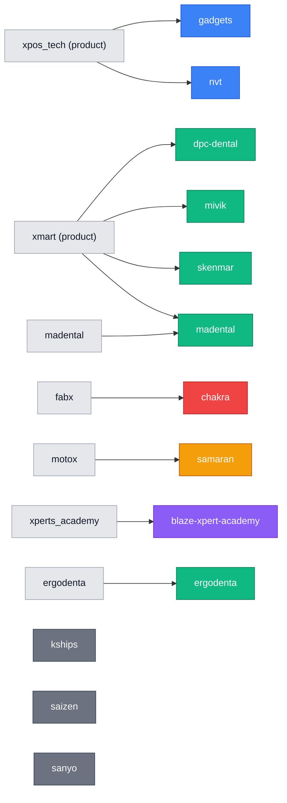

# Client → repo → domain matrix

Built directly from each `odoo-conf/*.conf`'s `addons_path` in `tpt-dev-scripts` (verified
2026-09-04) — this is the ground truth for which addon repo(s) each production client actually
loads, as opposed to inferring it from which workspace a repo happens to sit in. Cross-reference
with `products/` (shared, multi-client repos) and `clients/<domain>/` (per-client detail).

## Full matrix

| Client | Host | DB / dbfilter | Client-specific repo | Shared product | Domain | Other repos in `addons_path` |
|---|---|---|---|---|---|---|
| `gadgets` | ap-southeast-1 | `xpos_gadgets_live` | — | `xpos_tech` | POS | `product-variant`, `server-auth`, `tpt_addons`, `oca-repo/server-tools`, `oca-repo/partner-contact` |
| `nvt` | ap-southeast-1 | `xpos_nvt_live` | — | `xpos_tech` | POS | `product-variant`, `server-auth`, `oca-repo/server-tools` |
| `ergodenta` | eu-central-1 | `^17ergodenta-prod.*$` | `ergodenta` | — | E-commerce | `enterprise`, `design-themes`, `theme`, `server-auth`, `website`, `product-variant` |
| `madental` | eu-central-1 | `^17madental.*$` | `madental` | `xmart` | E-commerce | `enterprise`, `design-themes`, `theme`, `server-auth`, `website`, `social`, `tpt_addons` |
| `dpc-dental` | eu-central-1 (live) / ap-southeast-1 (dormant) | `17dpc-dental.prod` | — | `xmart` | E-commerce | `theme`, `design-themes`, `oca-repo/server-brand`, `oca-repo/server-tools`, `oca-repo/server-auth` (identical on both hosts) |
| `mivik` | ap-southeast-1 | `17mivik.prod` | — | `xmart` | E-commerce (India) | `enterprise`, `theme`, `design-themes`, `server-brand`, `oca-repo/server-tools`, `oca-repo/server-auth` |
| `skenmar` | ap-southeast-1 | `17skenmar_prod_v1.0` | — | `xmart` | E-commerce | `design-themes`, `server-brand`, `oca-repo/server-tools`, `tpt_addons` |
| `blaze-xpert-academy` | ap-southeast-1 | `17blaze_prod` | `xperts_academy` | — | Academy/Education | `enterprise`, `design-themes`, `server-brand`, `oca-repo/server-tools` |
| `samaran` | ap-southeast-1 | `17samaran.prod` | `motox` | — | Fleet/Rental | `server-brand`, `oca-repo/server-tools`, `oca-repo/server-auth`, `oca-repo/web` |
| `chakra` | ap-southeast-1 | `^17chakra.*$` | `fabx` | — | Manufacturing/Fabrication | `server-brand`, `oca-repo/server-tools`, `oca-repo/server-auth`, `oca-repo/web` |
| `kships` | ap-southeast-1 | `17kships_prod_v1.0` | — | — | Website (no custom code) | `design-themes`, `server-brand`, `oca-repo/server-tools` |
| `saizen` (inactive) | ap-southeast-1 | `17saizen_prod_v1.0` | — | — | Website (no custom code) | `design-themes`, `server-brand`, `oca-repo/server-tools` |
| `sanyo` (dormant) | ap-southeast-1 | `17sanyo_prod_v1.0` | — | — | Website (no custom code) | `design-themes`, `server-brand`, `oca-repo/server-tools` |

## What this reveals

- **Three repos are genuinely shared products**, not client-specific: `xpos_tech` (POS —
  `gadgets`, `nvt`), `xmart` (E-commerce — `dpc-dental`, `mivik`, `skenmar`, and layered onto
  `madental`'s bespoke repo). See `products/xpos-tech.md`, `products/xmart.md`.
- **`fabx` looked like it might be shared** (its README says "Xplore Labs", the same org name
  `xpos_tech` uses) but `chakra` is the only client referencing it in `addons_path` — treat it
  as bespoke unless another client's conf references it too.
- **`ergodenta` is the only e-commerce client with zero shared-product dependency** — fully
  bespoke, doesn't use `xmart` at all. `madental` is the only client mixing both a bespoke repo
  and a shared product.
- **`kships`, `saizen`, `sanyo` have no client-specific or product repo whatsoever** — just
  `design-themes` + `server-brand` + `oca-repo/server-tools`. Whatever they need comes from core
  Odoo or the theme. If a custom repo is ever added for one of them, move that client's file
  out of `clients/website/` into the right domain folder.
- `design-themes`, `server-brand`, `theme`, `tpt_addons`, and the `oca-repo/*` entries are
  generic shared infrastructure (theming, OCA server tooling) — not domain products, so they
  don't get their own `products/` entry.
- `tpt_addons` and `product-variant` are referenced by multiple clients but haven't been located/
  reviewed yet — TODO once cloned, confirm whether either is domain-specific enough to warrant
  its own `products/` entry.

## Repo → client map (visual)

`kships`/`saizen`/`sanyo` have no repo edge — see "What this reveals" above.
